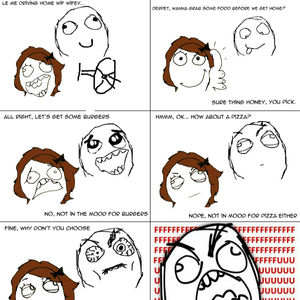

# Kékomer

This web application allows the user to filter food options according to their preferences for categories or types, price range, location, and opening times for restaurants in order to provide a random choice.\
This is possible thanks to Google Places API!

## tl;dr,
1. Filter food options
2. Get a random choice
3. Enjoy!